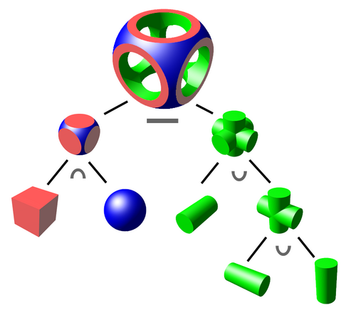
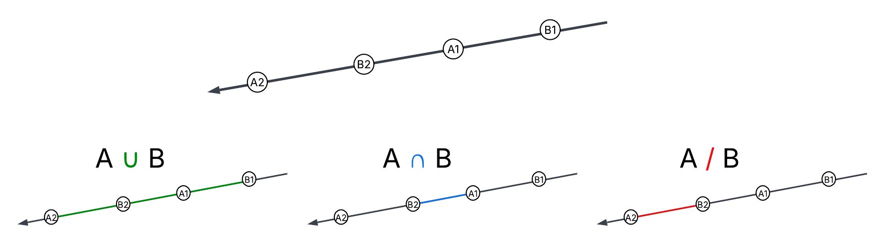
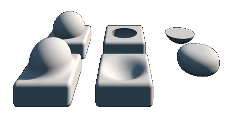
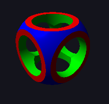

#### **Course: _Research project - GPU algorithms_**

####  **Coordinator:** *Krzysztof Kaczmarski*

<br>

#### **Authors:** *Marcin Cieszyński*, *Jakub Pietrzak*
#### **Date:**  25.05.2025
#### **Description:** Comparison of algorithms to render CSG trees in realtime.
#### **Code repository:** [Github](https://github.com/Zumi002/CUDA-CSG-Tree-Raycasting/tree/CSGComparison)
#### **Code license:** [MIT License](https://github.com/Zumi002/CUDA-CSG-Tree-Raycasting/tree/CSGComparison?tab=License-1-ov-file)
#### **Input files:** Example CSG trees provided in [Test folder](https://github.com/Zumi002/CUDA-CSG-Tree-Raycasting/tree/CSGComparison/Test)

<br>

## Report goals
### This report aims to:
- Compare performance and visual quality between three algorithms for rendering Constructive Solid Geometry (CSG) trees in real time using CUDA.
- Explain how each algorithm works, including implementation details and computational efficiency.
- Provide best practises on how to construct efficient CSG trees
- Suggest future improvements and possible research directions.
## Problem statement
**Constructive Solid Geometry (CSG)** is a modeling technique for creating complex 3D objects by combining simpler shapes using boolean operations like union, intersection, and difference.
Rendering CSG models in real time is challenging due to the computational complexity of evaluating these boolean operations. Traditional **rasterization-based** approaches, which attempt to **convert the entire CSG tree into a mesh**, often result in a loss of detail or geometric fidelity — especially when dealing with deeply nested operations or sharp features.

**Raycasting** methods, in contrast, evaluate the CSG tree directly at each pixel, preserving full detail and enabling more accurate visualization. They work especially well with **implicit representations**, where each primitive is described by a mathematical function rather than a polygonal mesh. This avoids discretization errors and ensures that fine details—such as sharp edges or exact intersections—are retained regardless of screen resolution or viewing distance.

Another widely used non-meshing approach is **raymarching using signed distance fields (SDFs)**. This technique approximates the surface of an object by iteratively stepping along a ray until it reaches close proximity to an implicit surface. Raymarching is **relatively simple to implement**, making it a popular choice for creative applications, procedural rendering, and demoscene projects. Moreover, it enables **features that are difficult or even impossible with traditional CSG**, such as **smooth blending between shapes**, soft transitions, and morphing effects.

However, SDF-based raymarching can struggle with sharp edges, complex boolean operations, or precision-critical applications like CAD—**much like meshing approaches**. Although it avoids the need for explicit mesh generation, it still introduces approximation artifacts and lacks exact surface evaluation. Additionally, it requires careful tuning of step size and maximum iterations to balance performance and visual quality.

In this project, we aim to compare different non-meshing rendering techniques—specifically:

- Direct CSG tree evaluation via raycasting,
- Raymarching using signed distance fields (SDFs),

to assess their respective performance, accuracy, and suitability for real-time rendering of complex, high-detail CSG models.

Our motivation is to develop and analyze GPU-based methods that can:

- Render complex CSG structures interactively with full geometric detail.
- Be integrated into real-time applications such as CAD tools, 3D modeling software, or games.
- Take full advantage of GPU parallelism.
## Computational method
### Constructive Solid Geometry (CSG)
**Constructive Solid Geometry (CSG)** is a modeling technique used to build complex 3D shapes by combining simpler primitives using boolean operations. CSG represents scenes as trees, where:
- **Leaves** are basic 3D primitives such as spheres.
- **Internal nodes** represent boolean operations such as:
    - **Union (A ∪ B)**: combines two solids into one,
    - **Intersection (A ∩ B)**: keeps only the overlapping volume,
    - **Difference (A \ B)**: subtracts one solid from another.

<p align="center">

</p>

In our implementation, we support three basic primitives:
- **Sphere**
- **Cube**
- **Cylinder**

Each primitive is defined **implicitly**, via a mathematical function that describes whether a point lies inside or outside the shape.
### Rendering approaches

This project compares three computational approaches to rendering CSG scenes on the GPU: traditional raycasting, single-hit CSG traversal based on recent research, and raymarching with signed distance fields (SDFs).

#### 1. Traditional raycasting of CSG trees

In the classic raycasting approach, each ray is tested against every primitive in the scene to compute **all intersection points** along its path. These intersections are stored in an array, and then the CSG tree is traversed in the correct order to evaluate the final surface hit using the boolean operations defined in the tree.
For a given set of intersection points along a ray, the boolean operations are applied as follows:

<p align="center">

</p>


This method provides **high accuracy** and **correct surface reconstruction**, handling even deeply nested or complex boolean expressions reliably. However, it comes at a cost: storing **all intersections per ray** and intermediate results is **memory-intensive** and inefficient on the GPU. This makes the approach **memory-bound**, which limits its scalability for large scenes or real-time applications.

#### 2. Single-hit CSG traversal

This approach is based on **Andrew Kensler’s** method (_Ray Tracing CSG Objects Using Single Hit Intersections_), which avoids storing all ray-primitive intersections. Instead of collecting every hit along the ray, it tracks only the **first valid intersection** with a primitive or sub-tree and determines whether additional hits are needed to resolve the final result.

To enable this method, we must make a few assumptions about our primitives: they must be **closed**, **non-self-intersecting**, and have **consistently oriented normals**. In our case — using simple primitives like spheres, cubes, and cylinders — these requirements pose no limitations. For each internal (non-leaf) node, specific actions are taken depending on the node’s boolean operation and the hit information returned from its left and right subtrees.

While obtaining the final hit may require **recalculating intersections** with some primitives or subtrees multiple times, this method significantly reduces memory usage compared to the traditional approach. As a result, it is much more suitable for GPU execution, where memory pressure is often a limiting factor.

A GPU-friendly variant of this technique was proposed by **D.Y. Ulyanov, D.K. Bogolepov, and V.E. Turlapov** in their work _Spatially Efficient Tree Layout for GPU Ray-tracing of Constructive Solid Geometry Scenes_. Their method builds on Kensler’s approach by introducing a **finite state machine** with a stack to manage all possible traversal actions in a structured and efficient way.

An additional optimization described in their paper involves using a **Bounding Volume Hierarchy (BVH)** to quickly eliminate subtrees that do not intersect the ray, further reducing unnecessary computations and improving performance.

On top of that, the authors describe a technique for **transforming CSG trees into a more GPU-friendly form**, improving traversal performance significantly — sometimes by multiple times. However, in our project we chose **not to implement this optimization**, to ensure all algorithms are compared under the same conditions and assumptions.

#### 3. Raymarching with signed distance fields

The third approach is **raymarching using signed distance fields (SDFs)**, a widely used technique in procedural graphics. Instead of explicitly computing intersections, this method steps along the ray using a distance estimate to the nearest surface, derived from implicit functions.

To render a CSG tree using SDFs, we must compute the signed distance to the **entire tree**. This is done by evaluating the distance to each primitive and then combining those distances according to the tree's boolean operations.

Implementing these boolean operations is significantly simpler than in the previous algorithms. In this context, they reduce to straightforward mathematical operations:

- **Union**: `min(distA, distB)`
- **Intersection**: `max(distA, distB)`
- **Difference**: `max(distA, -distB)`

By traversing the CSG tree in **post-order**, we can evaluate the combined distance using a **stack-based** approach, avoiding the need to store distances for all primitives—leading to more memory-efficient execution.

Raymarching also enables unique visual effects such as **smooth blending** between primitives, which are not possible with traditional boolean operations. This makes it particularly attractive for **stylized rendering** in games or procedural modeling tools:

<p align="center">

</p>

However, like meshing-based methods, SDF raymarching is **approximate**. It can struggle with **sharp features**, **complex boolean expressions**, or **precision-sensitive applications** such as CAD. The algorithm typically marches along the ray **until it gets sufficiently close to the surface** (within a small threshold) or **until a maximum number of steps is reached**. In **tight regions** or when the ray travels at a **shallow angle** relative to a surface, this can lead to **visual artifacts**, such as missed intersections or inaccurate shading. Careful tuning of parameters like **step size**, **convergence thresholds**, and **maximum iterations** is required to balance quality and performance while maintaining stability.
## Program architecture

The **program** follows the structure of a simple renderer. The central component is the `Application` class, which coordinates **key subsystems** such as the `RendererManager`, responsible for displaying the image, and the `InputManager`, which handles user input.

The `RendererManager` manages the **OpenGL context** and handles rendering logic. It invokes the `Raycaster`, which performs the **CUDA**-based computation and writes the final image to a **GPU buffer**. This buffer is then displayed as a fullscreen texture mapped onto a quad that covers the entire viewport. Additionally, the renderer generates an interactive GUI using **Dear ImGui**, allowing users to **load different CSG trees** via a file dialog, **switch between rendering algorithms**, **adjust camera settings** (such as **Freeroam** or **Orbital** mode, movement **speed**, and **mouse sensitivity**), **change the light direction**, and **monitor real-time performance** through a live **FPS counter**.

The core logic lies in the `Raycaster` class, which is responsible for launching the appropriate **CUDA kernels** and managing GPU memory. Based on the selected algorithm, it prepares the correct CSG tree representation in GPU memory and invokes the corresponding kernel. Each algorithm’s kernel is defined in its own dedicated `.cuh` file, providing a modular structure that makes it easier to manage and understand.

The program uses the following key technologies and dependencies:

- **SDL2** – for creating and managing the application window and handling input events.
- **OpenGL** – for rendering the final image to the screen.
- **GLAD** – for managing OpenGL function pointers.
- **CUDA** – for executing raycasting algorithms on the GPU, with **CUDA-OpenGL interoperability** to write the output directly into OpenGL buffers for efficient display.
- **Dear ImGui** – for the graphical user interface.
- **ImGuiFileBrowser** (header-only) – for file selection dialogs.
- **CLI11** (header-only) – for command-line argument parsing.

All dependencies are included in the repository for convenience and ease of compilation.

> **Note**: In order to run the compiled executable, make sure that `SDL2.dll` is present in the same directory. This file is automatically copied to the output folder during the build process.


## Input data description

As input data, we use a **custom text-based file format** specifically designed for simplicity and ease of use. We chose to create our own format because existing CSG file formats were either difficult to find, overly complex, or tailored for specific modeling software, which made them unsuitable for our needs.

Our format describes a **CSG tree in preorder traversal**, where each line corresponds to a single node. Nodes are either **operators** (`Union`, `Intersection`, `Difference`) or **primitives** (`Sphere`, `Cylinder`, `Cube`). Each primitive includes its parameters directly after its type.

The supported primitives and their required parameters are:

- `Sphere`:  
    `(float) posX posY posZ (hex) color (float) radius`  
    _Example:_ `Sphere 0 0 0 FF0000 1.2`
- `Cube`:  
    `(float) posX posY posZ (hex) color (float) edgeLength`  
    _Example:_ `Cube 1 2 3 00FF00 2`
- `Cylinder`:  
    `(float) posX posY posZ (hex) color (float) radius (float) height (float) rotX rotY rotZ`  
    _Example:_ `Cylinder 0 0 0 0000FF 0.5 3 90 0 0`


We also support optional **tab indentation** to visually distinguish tree levels and improve readability, though it’s not required for parsing.
#### Example

Here's a sample CSG tree definition:
```
Difference
	Intersection
		Cube 0 0 0 FF0000 2
		Sphere 0 0 0 0000FF 1.35
	Union
		Union
			Cylinder 0 0 0 00FF00 0.7 2.1 90 0 0
			Cylinder 0 0 0 00FF00 0.7 2.1 0 0 0
		Cylinder 0 0 0 00FF00 0.7 2.1 0 0 90
```
This defines a CSG object that is the **difference** between:

- the **intersection** of a red cube and a blue sphere
- and the **union** of three green cylinders placed along the three main axes.

Which corresponds to a well-known example already presented in our report:

<p align="center">

</p>

And here’s how it looks rendered using our application:

<p align="center">

</p>

User can open CSG tree using `--file <path to tree file>` argument when lauching from console, or use `Load CSGTree...` file browser dialog, to choose tree.

## Execution configuration and user guide

## Description of the results

## Remarks

## Future works

## References