#### **Course: _Research project - GPU algorithms_**

####  **Coordinator:** *Krzysztof Kaczmarski*

<br>

#### **Authors:** *Marcin Cieszyński*, *Jakub Pietrzak*
#### **Date:**  25.05.2025
#### **Description:** Comparison of algorithms to render CSG trees in realtime.
#### **Code repository:** [Github](https://github.com/Zumi002/CUDA-CSG-Tree-Raycasting/tree/CSGComparison)
#### **Code license:** [MIT License](https://github.com/Zumi002/CUDA-CSG-Tree-Raycasting/tree/CSGComparison?tab=License-1-ov-file)
#### **Input files:** Example CSG trees provided in [Test folder](https://github.com/Zumi002/CUDA-CSG-Tree-Raycasting/tree/CSGComparison/Test)

<br>

## Report goals
### This report aims to:
- Compare performance and visual quality between three algorithms for rendering Constructive Solid Geometry (CSG) trees in real time using CUDA.
- Explain how each algorithm works, including implementation details and computational efficiency.
- Provide best practises on how to construct efficient CSG trees
- Suggest future improvements and possible research directions.
## Problem statement
**Constructive Solid Geometry (CSG)** is a modeling technique for creating complex 3D objects by combining simpler shapes using boolean operations like union, intersection, and difference.
Rendering CSG models in real time is challenging due to the computational complexity of evaluating these boolean operations. Traditional **rasterization-based** approaches, which attempt to **convert the entire CSG tree into a mesh**, often result in a loss of detail or geometric fidelity — especially when dealing with deeply nested operations or sharp features.

**Raycasting** methods, in contrast, evaluate the CSG tree directly at each pixel, preserving full detail and enabling more accurate visualization. They work especially well with **implicit representations**, where each primitive is described by a mathematical function rather than a polygonal mesh. This avoids discretization errors and ensures that fine details—such as sharp edges or exact intersections—are retained regardless of screen resolution or viewing distance.

Another widely used non-meshing approach is **raymarching using signed distance fields (SDFs)**. This technique approximates the surface of an object by iteratively stepping along a ray until it reaches close proximity to an implicit surface. Raymarching is **relatively simple to implement**, making it a popular choice for creative applications, procedural rendering, and demoscene projects. Moreover, it enables **features that are difficult or even impossible with traditional CSG**, such as **smooth blending between shapes**, soft transitions, and morphing effects.

However, SDF-based raymarching can struggle with sharp edges, complex boolean operations, or precision-critical applications like CAD—**much like meshing approaches**. Although it avoids the need for explicit mesh generation, it still introduces approximation artifacts and lacks exact surface evaluation. Additionally, it requires careful tuning of step size and maximum iterations to balance performance and visual quality.

In this project, we aim to compare different non-meshing rendering techniques—specifically:

- Direct CSG tree evaluation via raycasting,
- Raymarching using signed distance fields (SDFs),

to assess their respective performance, accuracy, and suitability for real-time rendering of complex, high-detail CSG models.

Our motivation is to develop and analyze GPU-based methods that can:

- Render complex CSG structures interactively with full geometric detail.
- Be integrated into real-time applications such as CAD tools, 3D modeling software, or games.
- Take full advantage of GPU parallelism.
## Computational method
### Constructive Solid Geometry (CSG)
**Constructive Solid Geometry (CSG)** is a modeling technique used to build complex 3D shapes by combining simpler primitives using boolean operations. CSG represents scenes as trees, where:
- **Leaves** are basic 3D primitives such as spheres.
- **Internal nodes** represent boolean operations such as:
    - **Union (A ∪ B)**: combines two solids into one,
    - **Intersection (A ∩ B)**: keeps only the overlapping volume,
    - **Difference (A \ B)**: subtracts one solid from another.

<p align="center">
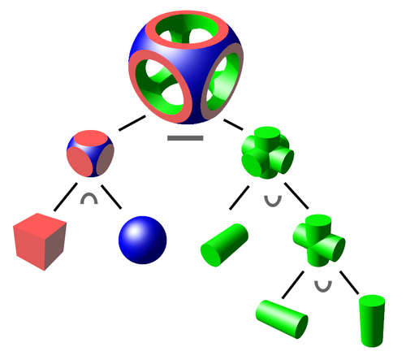
</p>

In our implementation, we support three basic primitives:
- **Sphere**
- **Cube**
- **Cylinder**

Each primitive is defined **implicitly**, via a mathematical function that describes whether a point lies inside or outside the shape.
### Rendering approaches

This project compares three computational approaches to rendering CSG scenes on the GPU: traditional raycasting, single-hit CSG traversal based on recent research, and raymarching with signed distance fields (SDFs).

#### 1. Traditional raycasting of CSG trees

In the classic raycasting approach, each ray is tested against every primitive in the scene to compute **all intersection points** along its path. These intersections are stored in an array, and then the CSG tree is traversed in the correct order to evaluate the final surface hit using the boolean operations defined in the tree.
For a given set of intersection points along a ray, the boolean operations are applied as follows:

<p align="center">
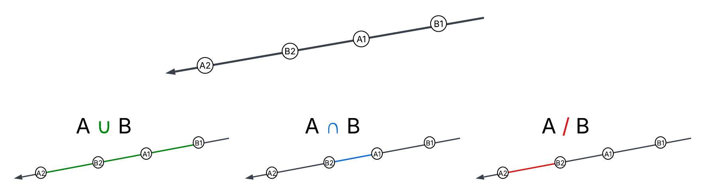
</p>


This method provides **high accuracy** and **correct surface reconstruction**, handling even deeply nested or complex boolean expressions reliably. However, it comes at a cost: storing **all intersections per ray** and intermediate results is **memory-intensive** and inefficient on the GPU. This makes the approach **memory-bound**, which limits its scalability for large scenes or real-time applications.

#### 2. Single-hit CSG traversal

This approach is based on **Andrew Kensler’s** method (_Ray Tracing CSG Objects Using Single Hit Intersections_), which avoids storing all ray-primitive intersections. Instead of collecting every hit along the ray, it tracks only the **first valid intersection** with a primitive or sub-tree and determines whether additional hits are needed to resolve the final result.

To enable this method, we must make a few assumptions about our primitives: they must be **closed**, **non-self-intersecting**, and have **consistently oriented normals**. In our case — using simple primitives like spheres, cubes, and cylinders — these requirements pose no limitations. For each internal (non-leaf) node, specific actions are taken depending on the node’s boolean operation and the hit information returned from its left and right subtrees.

While obtaining the final hit may require **recalculating intersections** with some primitives or subtrees multiple times, this method significantly reduces memory usage compared to the traditional approach. As a result, it is much more suitable for GPU execution, where memory pressure is often a limiting factor.

A GPU-friendly variant of this technique was proposed by **D.Y. Ulyanov, D.K. Bogolepov, and V.E. Turlapov** in their work _Spatially Efficient Tree Layout for GPU Ray-tracing of Constructive Solid Geometry Scenes_. Their method builds on Kensler’s approach by introducing a **finite state machine** with a stack to manage all possible traversal actions in a structured and efficient way.

An additional optimization described in their paper involves using a **Bounding Volume Hierarchy (BVH)** to quickly eliminate subtrees that do not intersect the ray, further reducing unnecessary computations and improving performance.

On top of that, the authors describe a technique for **transforming CSG trees into a more GPU-friendly form**, improving traversal performance significantly — sometimes by multiple times. However, in our project we chose **not to implement this optimization**, to ensure all algorithms are compared under the same conditions and assumptions.

#### 3. Raymarching with signed distance fields

The third approach is **raymarching using signed distance fields (SDFs)**, a widely used technique in procedural graphics. Instead of explicitly computing intersections, this method steps along the ray using a distance estimate to the nearest surface, derived from implicit functions.

To render a CSG tree using SDFs, we must compute the signed distance to the **entire tree**. This is done by evaluating the distance to each primitive and then combining those distances according to the tree's boolean operations.

Implementing these boolean operations is significantly simpler than in the previous algorithms. In this context, they reduce to straightforward mathematical operations:

- **Union**: `min(distA, distB)`
- **Intersection**: `max(distA, distB)`
- **Difference**: `max(distA, -distB)`

By traversing the CSG tree in **post-order**, we can evaluate the combined distance using a **stack-based** approach, avoiding the need to store distances for all primitives—leading to more memory-efficient execution.

Raymarching also enables unique visual effects such as **smooth blending** between primitives, which are not possible with traditional boolean operations. This makes it particularly attractive for **stylized rendering** in games or procedural modeling tools:

<p align="center">
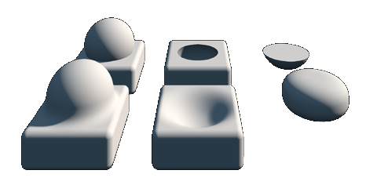
</p>

However, like meshing-based methods, SDF raymarching is **approximate**. It can struggle with **sharp features**, **complex boolean expressions**, or **precision-sensitive applications** such as CAD. The algorithm typically marches along the ray **until it gets sufficiently close to the surface** (within a small threshold) or **until a maximum number of steps is reached**. In **tight regions** or when the ray travels at a **shallow angle** relative to a surface, this can lead to **visual artifacts**, such as missed intersections or inaccurate shading. Careful tuning of parameters like **step size**, **convergence thresholds**, and **maximum iterations** is required to balance quality and performance while maintaining stability.
## Program architecture

The **program** follows the structure of a simple renderer. The central component is the `Application` class, which coordinates **key subsystems** such as the `RendererManager`, responsible for displaying the image, and the `InputManager`, which handles user input.

The `RendererManager` manages the **OpenGL context** and handles rendering logic. It invokes the `Raycaster`, which performs the **CUDA**-based computation and writes the final image to a **GPU buffer**. This buffer is then displayed as a fullscreen texture mapped onto a quad that covers the entire viewport. Additionally, the renderer generates an interactive GUI using **Dear ImGui**, allowing users to **load different CSG trees** via a file dialog, **switch between rendering algorithms**, **adjust camera settings** (such as **Freeroam** or **Orbital** mode, movement **speed**, and **mouse sensitivity**), **change the light direction**, and **monitor real-time performance** through a live **FPS counter**.

The core logic lies in the `Raycaster` class, which is responsible for launching the appropriate **CUDA kernels** and managing GPU memory. Based on the selected algorithm, it prepares the correct CSG tree representation in GPU memory and invokes the corresponding kernel. Each algorithm’s kernel is defined in its own dedicated `.cuh` file, providing a modular structure that makes it easier to manage and understand.

The program uses the following key technologies and dependencies:

- **SDL2** – for creating and managing the application window and handling input events.
- **OpenGL** – for rendering the final image to the screen.
- **GLAD** – for managing OpenGL function pointers.
- **CUDA** – for executing raycasting algorithms on the GPU, with **CUDA-OpenGL interoperability** to write the output directly into OpenGL buffers for efficient display.
- **Dear ImGui** – for the graphical user interface.
- **ImGuiFileBrowser** (header-only) – for file selection dialogs.
- **CLI11** (header-only) – for command-line argument parsing.

All dependencies are included in the repository for convenience and ease of compilation.

> **Note**: In order to run the compiled executable, make sure that `SDL2.dll` is present in the same directory. This file is automatically copied to the output folder during the build process.


## Input data description

As input data, we use a **custom text-based file format** specifically designed for simplicity and ease of use. We chose to create our own format because existing CSG file formats were either difficult to find, overly complex, or tailored for specific modeling software, which made them unsuitable for our needs.

Our format describes a **CSG tree in preorder traversal**, where each line corresponds to a single node. Nodes are either **operators** (`Union`, `Intersection`, `Difference`) or **primitives** (`Sphere`, `Cylinder`, `Cube`). Each primitive includes its parameters directly after its type.

The supported primitives and their required parameters are:

- `Sphere`:  
    `(float) posX posY posZ (hex) color (float) radius`  
    _Example:_ `Sphere 0 0 0 FF0000 1.2`
- `Cube`:  
    `(float) posX posY posZ (hex) color (float) edgeLength`  
    _Example:_ `Cube 1 2 3 00FF00 2`
- `Cylinder`:  
    `(float) posX posY posZ (hex) color (float) radius (float) height (float) rotX rotY rotZ`  
    _Example:_ `Cylinder 0 0 0 0000FF 0.5 3 90 0 0`


We also support optional **tab indentation** to visually distinguish tree levels and improve readability, though it’s not required for parsing.
#### Example

Here's a sample CSG tree definition:
```
Difference
	Intersection
		Cube 0 0 0 FF0000 2
		Sphere 0 0 0 0000FF 1.35
	Union
		Union
			Cylinder 0 0 0 00FF00 0.7 2.1 90 0 0
			Cylinder 0 0 0 00FF00 0.7 2.1 0 0 0
		Cylinder 0 0 0 00FF00 0.7 2.1 0 0 90
```
This defines a CSG object that is the **difference** between:

- the **intersection** of a red cube and a blue sphere
- and the **union** of three green cylinders placed along the three main axes.

Which corresponds to a well-known example already presented in our report:

<p align="center">

</p>

And here’s how it looks rendered using our application:

<p align="center">
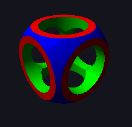
</p>

User can open CSG tree using `--file <path to tree file>` argument when lauching from console, or use `Load CSGTree...` file browser dialog, to choose tree.

## Execution configuration and user guide

The application can be launched either through the console with arguments or via its interactive graphical interface.

#### Console Mode – Testing and Batch Execution

To run tests in headless mode, use the `--file <path-to-tree-file>` argument along with `--test <0-2>`, where the test number corresponds to the desired algorithm:

- `0` – **Single Hit Algorithm**
- `1` – **Classic Algorithm**
- `2` – **Raymarching Algorithm**

Example:

`./CSGRayCasting.exe --file Trees/ExampleTree.txt --test 1`

If you want to save the results to a CSV file (e.g., for performance benchmarking or comparison), provide the `--result <path-to-result-file>` argument. This will either create a new CSV file or append results to an existing one:

`./CSGRayCasting.exe --file Trees/ExampleTree.txt --test 0 --result results.csv`

#### Interactive Mode – GUI

For interactive exploration and testing, simply run the application without the `--test` flag. The built-in GUI allows you to:

- Load different CSG trees at runtime (`Load CSGTree...`)
- Switch between rendering algorithms
- Adjust camera mode (Freeroam / Orbital), movement speed, and sensitivity
- Modify light direction
- View current FPS

<p align="center">
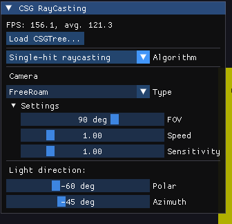
</p>

This makes it easy to experiment with different configurations and immediately see the impact of changes in real time.


## Profiling and optimizations

#### Profiling tool - Nvidia Nsight Compute (NCU)

<p align="center">

</p>

For profiling our CUDA kernels, we used **NVIDIA Nsight Compute (NCU)**. It is the latest profiling tool from NVIDIA, designed to replace the now-deprecated Visual Profiler. According to NVIDIA, Nsight Compute is significantly more powerful and provides a wider range of metrics and configuration options.

Additionally, the Nsight suite includes:

- **Nsight Systems**, for system-wide CPU and GPU performance analysis.

- **Nsight Graphics**, focused on graphics APIs, typically used in game development.


We chose **Nsight Compute**, as our primary interest was low-level performance of compute kernels, rather than CPU activity or graphics API usage.

##### How to use NCU

NCU supports two main modes:

- **Interactive profiling**, where you can pause and manually inspect specific kernel launches.

- **Non-interactive profiling**, which provides more flexibility and automation.

Typically, kernels are profiled by replaying them multiple times with different metrics being collected on each pass. **NCU** can also profile entire instruction ranges or the full application. In our case, due to the use of **OpenGL interoperability**, we were forced to use full **application replay**, since other modes (**kernel** or **range**), as we believe, conflicted with OpenGL memory mapping and caused crashes. These errors were difficult to diagnose, as **NCU** only returned a generic **"Unknown error"** message. 

Because of this limitation, we had to use the **non-interactive mode** of **NCU**. **Interactive profiling** only works with a single program execution, which wasn't feasible for full **application replay**. We configured **NCU** to automatically launch our  kernel several times, terminating the process afterward, each time collecting different metrics. This made the profiling process efficient without becoming too time-consuming.

To improve the quality of profiling reports, we strongly recommend enabling the compiler flag `-lineinfo`. In Visual Studio, this can be found under **Generate Line Number Information**. This option allows Nsight Compute to display the **source code** of the kernel alongside the generated **SASS (assembly) code**. Without it, only the SASS is available.

Enabling `-lineinfo` correlates the source code with the generated assembly and performance metrics. This provides valuable insight into which **lines of code are the most time-consuming**, what **types of memory accesses** are made from each line, how many **registers are used**, and much more. It makes it much easier to **identify and diagnose performance bottlenecks** at the source level. Note that in debug builds, `-lineinfo` is included by default.

#### Examples of Optimizations Identified via Profiling

##### Example 1 - finding simple errors
In our stack implementation, we found a major source of memory stalls:

<p align="center">
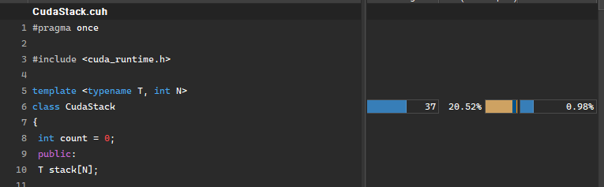
</p>

A similar issue was also observed in the `RayHitMinimal` struct, which is used to store intersection results for the `SingleHit` algorithm.

<p align="center">
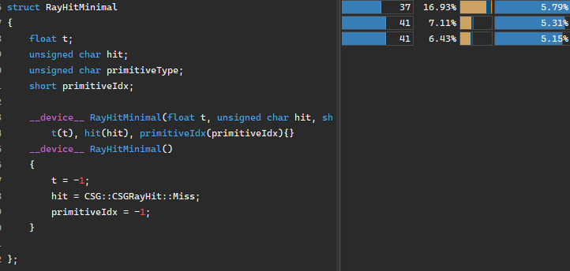
</p>

The `RayHitMinimal` instances were being stored in the stack, and the problem was caused by the use of a default constructor that initialized internal data. This resulted in **N simultaneous memory operations**, one per thread in the block, during stack creation. As all threads performed this initialization at the same time, it caused significant memory stalls.

To fix this, we **removed the default constructor**, simplifying the struct and eliminating automatic initialization. We now manually set the required values at the point of use, only when necessary.

This change **dramatically improved performance** of the `SingleHit` algorithm, especially for **smaller trees**, where execution time dropped from around **1.3 ms** to just **0.2 ms**.
 
<p align="center">
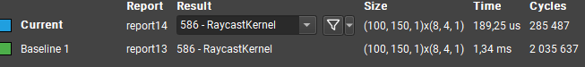
</p>
>Rapotr 14 is after, and raport 13 is before this fix.

##### Example 2 - comparing kernels with and without use of shared memory

We decided to introduce shared memory in our kernels to further squeeze out performance. Specifically, we added a second kernel for the **Raymarching** algorithm that uses shared memory when the tree is small enough to fit entirely into it. This significantly reduces the number of global memory accesses. Below are the memory charts:
<p align="center">
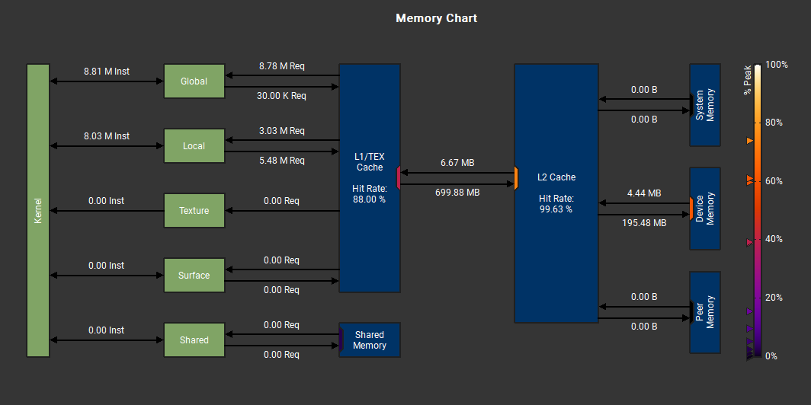
</p>
> Memory chart for kernel **without** shared memory


<p align="center">
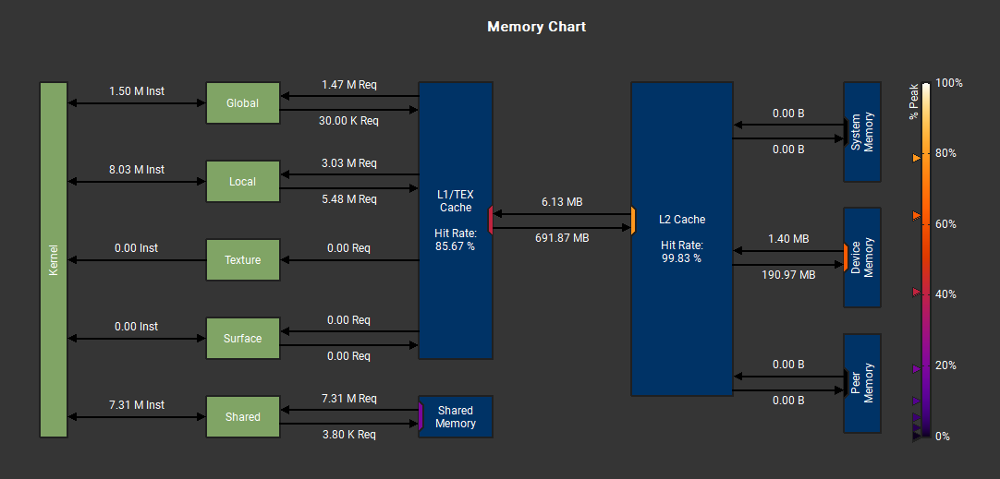
</p>
> Memory chart for kernel **with** shared memory


Unfortunately, during this test, we used a relatively small tree—much smaller than the available shared memory. As a result, most global memory accesses were already hitting the **L1 cache**, so the benefits of shared memory were less visible in the memory charts.

However, despite the cache coverage, we observed around a **7% performance improvement** in timing:

<p align="center">
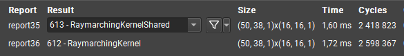
</p>

This is a promising result even for a small tree, and we see **even greater gains for larger trees**, as long as they still fit within shared memory.

#### Compiler options

While optimizing, we shouldn't forget about the impact of **compiler settings**. One of our first decisions was to write all kernels and device functions in `.cuh` header files. This allows everything to be compiled as a **single translation unit**, which enables the compiler to perform much more aggressive optimizations.

When you want to use device functions across multiple `.cu` files, you are required to enable the `-rdc` flag, which generates **relocatable device code**. This makes it possible to link device functions across translation units—but it comes at a performance cost. In our case, the overhead was significant: enabling `-rdc` reduced performance by **up to 75%**, dropping from around **40 FPS** to just **10 FPS**. To avoid this, we followed a common CUDA practice: writing kernel-related functions in header files (`.cuh`) so that they are included and compiled as part of the same translation unit, avoiding the need for `-rdc`, while still keeping the codebase reasonably modular.

Since our application is not focused on scientific or high-precision calculations, we also enabled the `-use_fast_math` flag. This allows the compiler to replace standard math functions with faster, less precise versions (e.g., `__sinf` instead of `sinf`). In our case, this provided a **significant speed boost**, especially for the `SingleHit` algorithm, which saw up to a **25% performance increase** on a fairly large tree.

## Testing methodology

To evaluate the performance of our rendering algorithms, we used a consistent and reproducible testing setup. Each test was conducted with a **fresh application launch** to avoid any caching effects or residual state. We tested **each algorithm independently**, one at a time, to isolate their performance characteristics.

During the test, the camera followed a **predefined, deterministic movement pattern** around the scene, lasting **30 seconds**. This movement was **time-based**, not frame-based, to ensure identical behavior across runs regardless of frame rate.

All tests were conducted in a **release mode** build with the `-O3` optimization level and `-use_fast_math` enabled for maximum performance. The rendering resolution was fixed at **800×600** for all tests to ensure comparability.

We collected the following performance metrics:

- **Average FPS**
- **1% low FPS** 

In addition to raw performance, we correlated the results with a simple **scene density** metric:

> the average number of primitives per rendered pixel (excluding pixels where the ray missed all geometry).

Tests were performed on **three different GPUs** — GTX 1050, GTX 1660, and RTX 2070 — using a variety of CSG trees stored in the `/tests` directory.

## Tests description

To evaluate different properties of our rendering algorithms, we conducted a series of focused test scenarios. Each test was designed to isolate specific characteristics and stress factors of the algorithms under controlled conditions.

#### Increasing number of primitives 
In this series, we examined how the algorithms behave as the number of primitives increases.  
We used only **spheres**, which are among the least computationally expensive primitives, and combined them using **union operations only**, which are also the simplest binary operations.

Here are some screenshots of the scenes used:
###### 16 spheres
<p align="center">

</p>

###### 64 spheres
<p align="center">
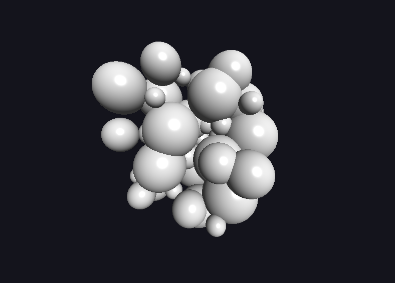
</p>

###### 256 spheres
<p align="center">
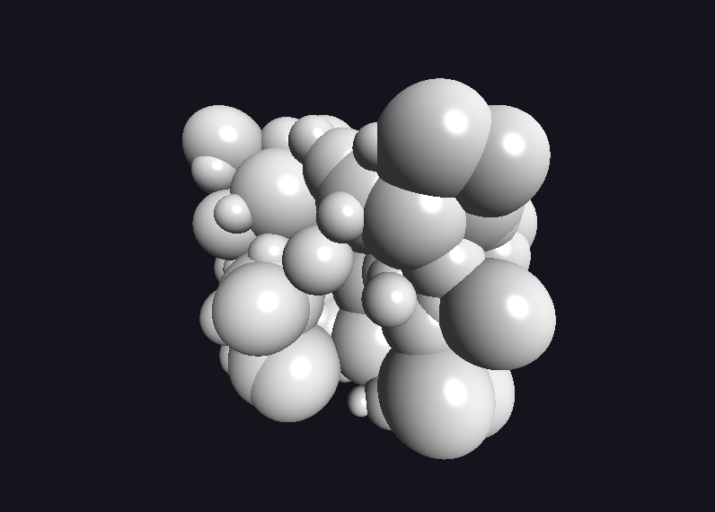
</p>

###### 1024 spheres
<p align="center">
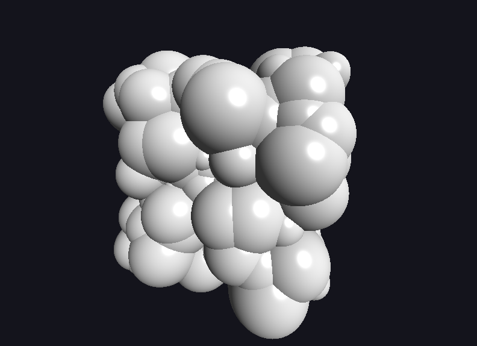
</p>

And a table summarizing the corresponding CSG trees:

| Tree Name         | # Primitives | Tree Height | Scene Density |
|-------------------:|-------------:|------------:|---------------:|
| 16 Spheres | 16 | 5 | 1.39 |
| 32 Spheres | 32 | 6 | 2.13 |
| 64 Spheres | 64 | 7 | 2.79 |
| 128 Spheres | 128 | 8 | 4.46 |
| 256 Spheres | 256 | 9 | 7.37 |
| 512 Spheres | 512 | 10 | 12.18 |
| 1024 Spheres | 1024 | 11 | 24.84 |

#### Balanced and unbalanced trees
In this test, we investigated the impact of **tree balance** on performance.  
We used the same scenes (unions of spheres) as in the previous test, but with two versions: one with a **perfectly balanced** tree(the same as in previous test) and one that was **heavily skewed**, which is reflected in their tree heights.

Table summarizing the corresponding CSG trees:

| Tree Name         | # Primitives | Tree Height | Scene Density |
|-------------------:|-------------:|------------:|---------------:|
| 16 Spheres Balanced | 16 | 5 | 1.39 |
| 16 Spheres Unbalanced | 16 | 16 | 1.38 |
| 64 Spheres Balanced | 64 | 7 | 2.79 |
| 64 Spheres Unbalanced | 64 | 64 | 2.77 |

#### Scene density
This test focused on how the algorithms perform when primitives are either **scattered across the scene** or **clustered closely together**.  
We used only **union operations**, but this time included a variety of primitives to check if performance varied depending on primitive type.

Here are the screenshots:
###### 256 spheres scattered
<p align="center">
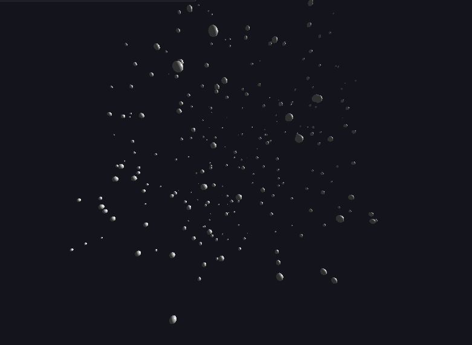
</p>

###### 256 spheres clustered
<p align="center">
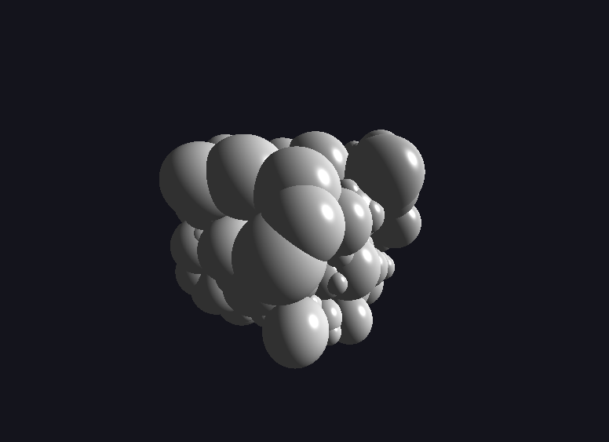
</p>

###### 256 cubes scattered
<p align="center">
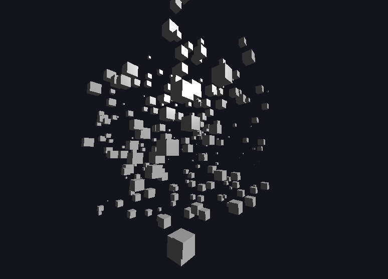
</p>

###### 256 cubes clustered
<p align="center">
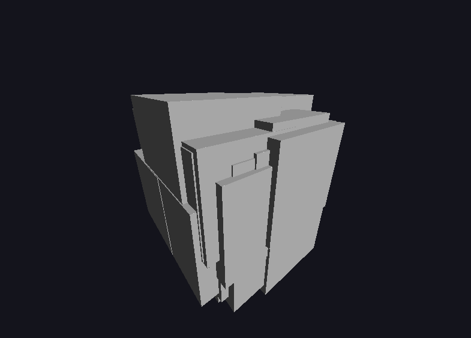
</p>

###### 256 cylinders scattered
<p align="center">
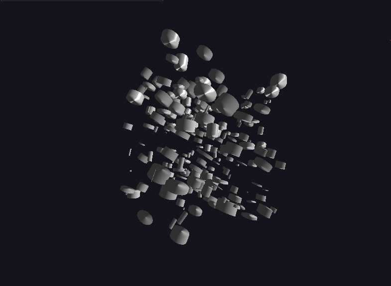
</p>

###### 256 cylinders clustered
<p align="center">
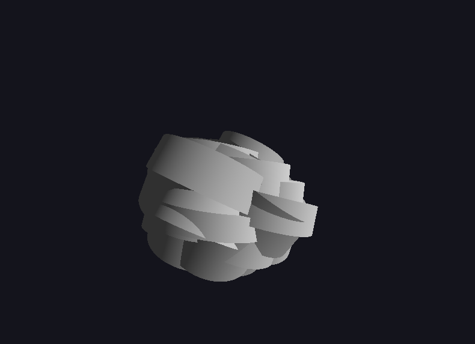
</p>

And a table summarizing the corresponding CSG trees:

| Tree Name         | # Primitives | Tree Height | Scene Density |
|-------------------:|-------------:|------------:|---------------:|
| 256 Spheres Scattered | 256 | 9 | 1.02 |
| 256 Spheres Clustered | 256 | 9 | 7.75 |
| 256 Cubes Scattered | 256 | 9 | 1.36 |
| 256 Cubes Clustered | 256 | 9 | 25.87 |
| 256 Cylinders Scattered | 256 | 9 | 1.65 |
| 256 Cylinders Clustered | 256 | 9 | 39.76 |

#### Binary operation test
In this series, we explored how different **binary operations** influence performance.  
To maximize interactions between primitives, we placed them in the same location. The only variable was the **type of operation** used in the CSG tree:

- Only **unions**
- Only **intersections**
- Only **differences**
- 
All tests used the same set of primitives and spatial configuration.

Screenshots of the scenes:
###### 64 spheres union
<p align="center">
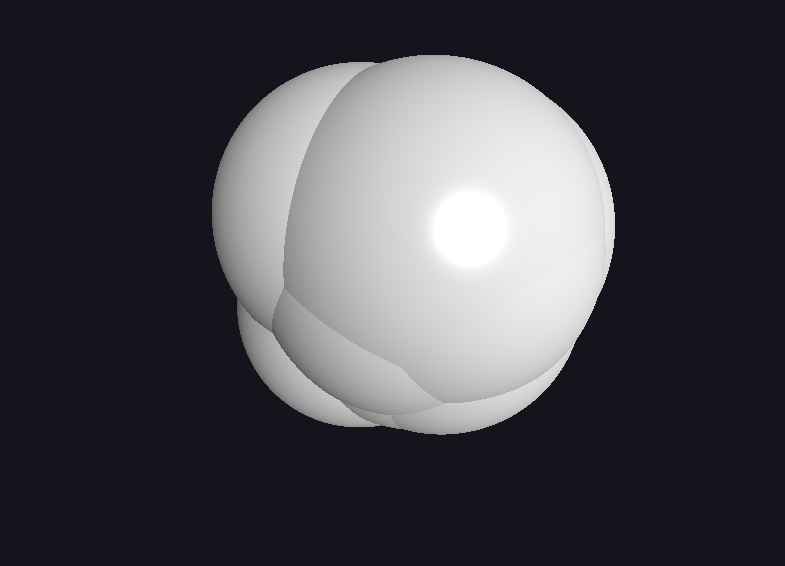
</p>

###### 64 spheres intersection
<p align="center">
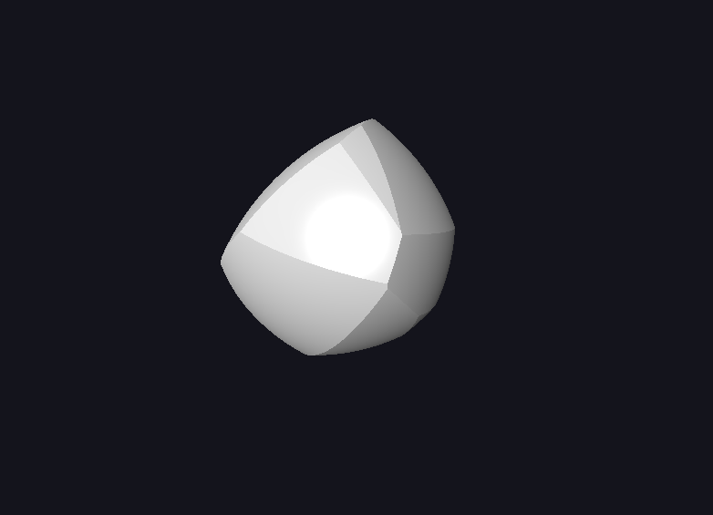
</p>

###### 64 spheres difference
<p align="center">
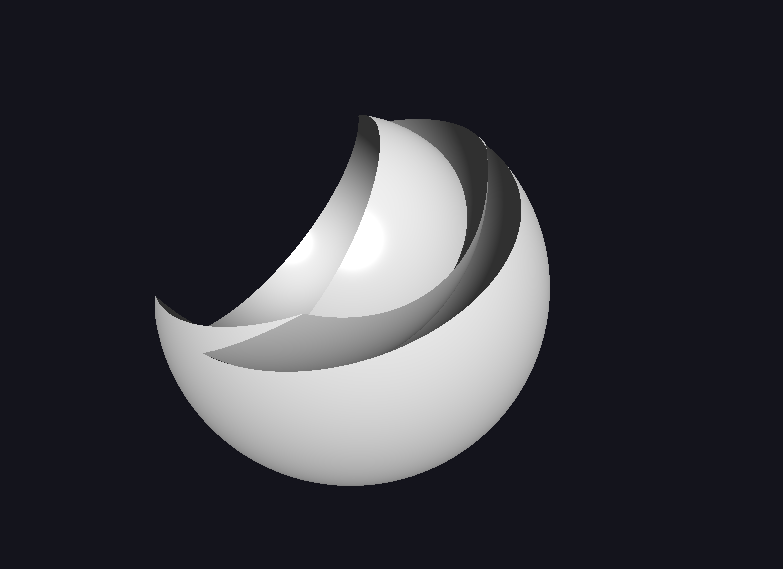
</p>

Table summarizing the corresponding CSG trees:

| Tree Name         | # Primitives | Tree Height | Scene Density |
|-------------------:|-------------:|------------:|---------------:|
| Only Unions | 64 | 7 | 32.03 |
| Only Intersection | 64 | 7 | 36.02 |
| Only Difference | 64 | 7 | 36.47 |

#### Unbalance side test
This test examined how the **side of tree Unbalance** affects performance.  
We hypothesized that algorithms using a stack (like **Single-Hit Traversal** and **Ray Marching**) might benefit when the tree is unbalanced in a particular direction.

We used all primitive types in a consistent scene layout, modifying only the **tree structure**.

Trees summary:

| Tree Name         | # Primitives | Tree Height | Scene Density |
|-------------------:|-------------:|------------:|---------------:|
| Left Unbalanced Tree | 17 | 17 | 3.49 |
| Right Unbalanced Tree | 17 | 17 | 3.49 |

#### Usage test - cheese
To simulate a more realistic use case, we modeled a **cube with many spherical cutouts**, resembling Swiss cheese. This scene stresses the algorithms due to the high number of **difference operations** and overlapping geometry.

Scene preview:
###### 128 spheres cheese
<p align="center">
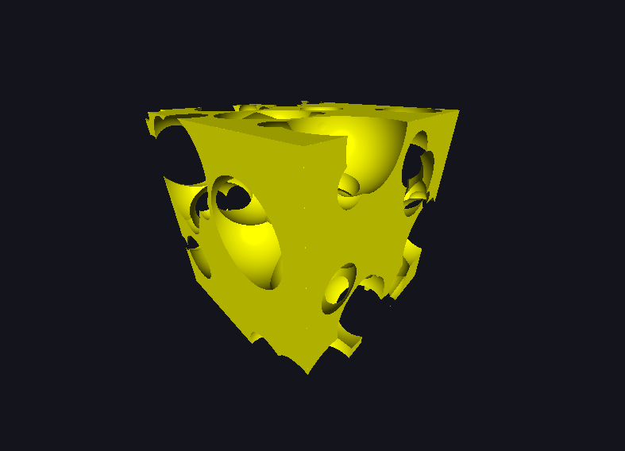
</p>

###### 512 spheres cheese
<p align="center">
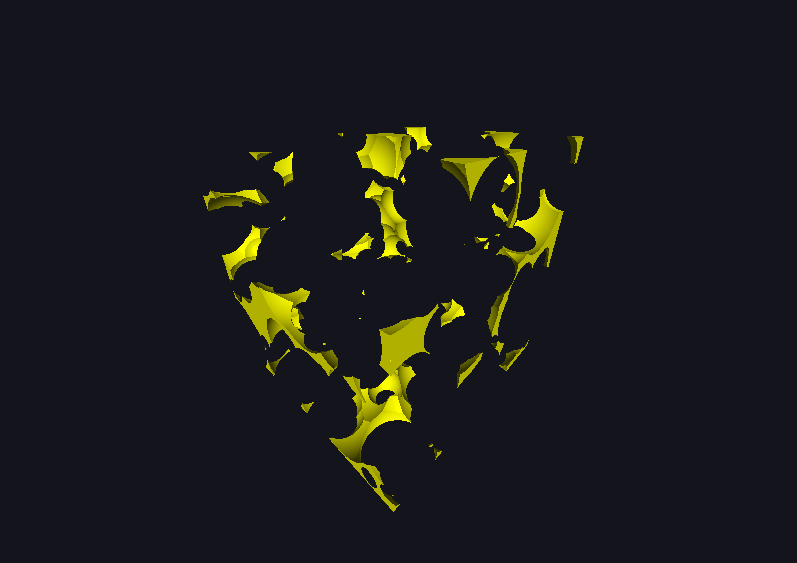
</p>

 CSG Trees summary:

| Tree Name         | # Primitives | Tree Height | Scene Density |
|-------------------:|-------------:|------------:|---------------:|
| 128 Spheres Cheese | 129 | 9 | 4.79 |
| 512 Spheres Cheese | 513 | 11 | 15.15 |

#### Usage test - labyrinth
Another test with more realistic use case of CSG, we designed a **labyrinth** scene on a 16×16 grid using two different modeling strategies:

1. **Union of cubes** to represent the maze walls.
2. A **single cube** with corridor paths **subtracted** using difference operations.

These contrasting approaches allowed us to assess how each algorithm handles dense union trees versus difference-based structures.

Screenshot:
###### Labyrinth
<p align="center">
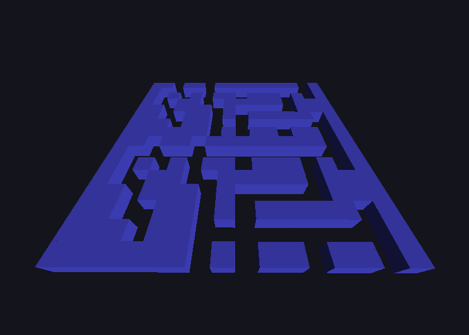
</p>

CSG tree information:

| Tree Name         | # Primitives | Tree Height | Scene Density |
|-------------------:|-------------:|------------:|---------------:|
| Union Labirynth | 148 | 9 | 1.92 |
| Difference Labirynth | 109 | 9 | 1.68 |

## Description of the results

#### Increasing number of primitives 
In this test, we observed that for **traditional raycasting** and **raymarching**, doubling the number of primitives generally led to **a halving of FPS**, indicating a linear increase in rendering time with respect to scene complexity.

The **single-hit** algorithm behaved slightly differently. Initially, performance degraded slowly, and only gradually dropped to **halving of FPS** when the number of primitives doubled. Notably, when moving from 512 to 1024 spheres, the drop in FPS was **less than half**.

We also observed that **traditional raycasting** scaled linearly with GPU performance—roughly doubling in speed from one GPU tier to the next. However, **single-hit** showed **uneven scaling**: performance improved dramatically between the GTX 1050 and GTX 1660, especially in large trees, but not as significantly between the GTX 1660 and RTX 2070.

A consistent trend across all tests was that **1% low FPS** for the single-hit algorithm was much worse than the others. This is due to the algorithm’s **angle-dependent behavior**, which can introduce instability depending on the viewpoint.
###### Results for GTX 1050
<p align="center">
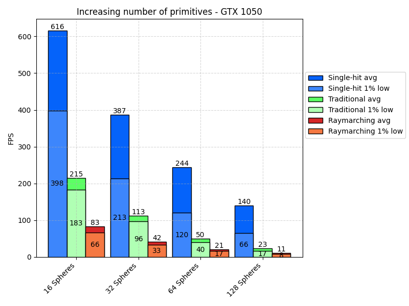
</p>
###### Results for GTX 1660
<p align="center">
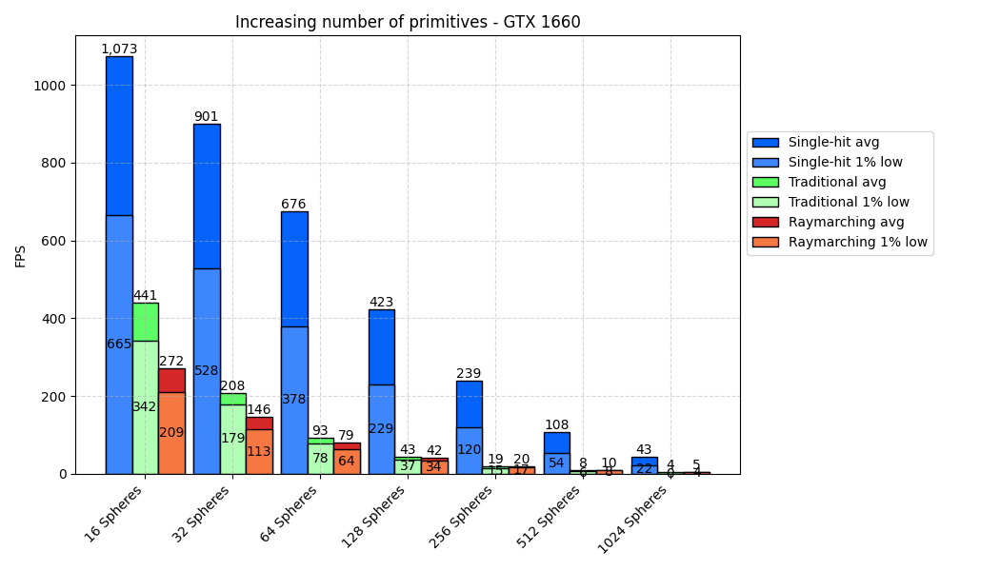
</p>
###### Results for RTX 2070
<p align="center">
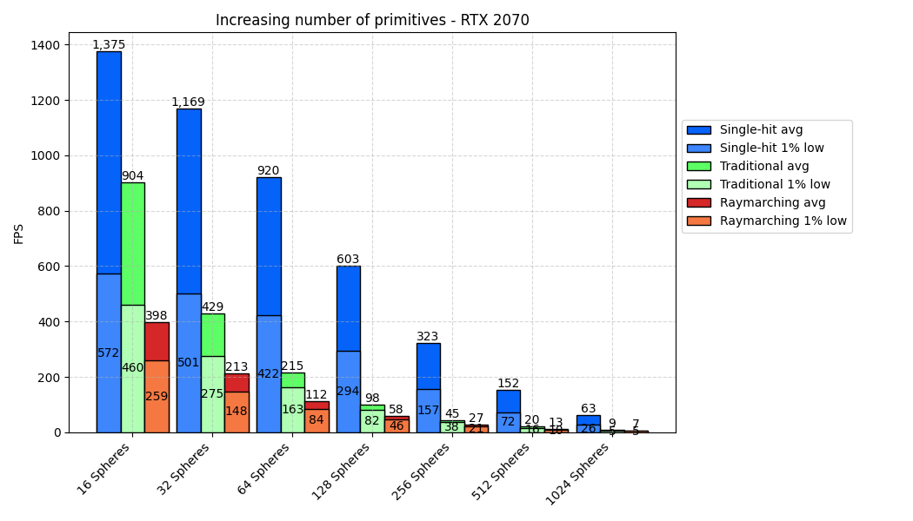
</p>

#### Balanced and unbalanced trees

Here, **tree balance** had the most significant impact on **traditional raycasting**, with almost no noticeable effect on **single-hit** and **raymarching**. Balanced trees performed consistently better in the traditional approach.

An interesting exception appeared on the GTX 1050, where in the case of **64 unbalanced spheres**, raycasting and raymarching performed nearly identically. However, on more powerful GPUs, **raymarching consistently outperformed raycasting**.

###### Results for GTX 1050
<p align="center">
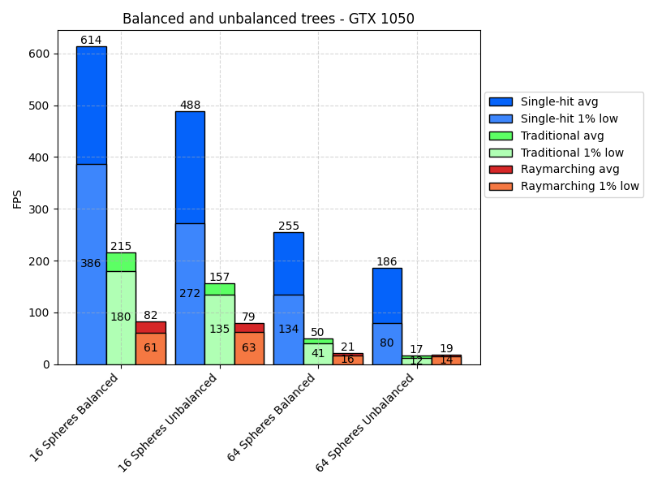
</p>
###### Results for GTX 1660
<p align="center">
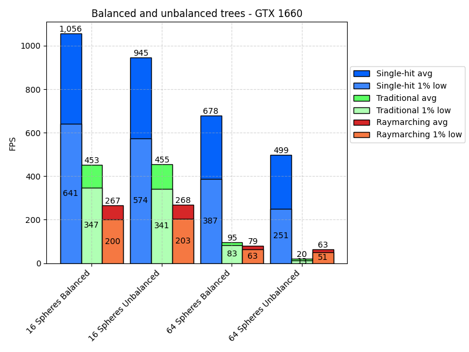
</p>
###### Results for RTX 2070
<p align="center">
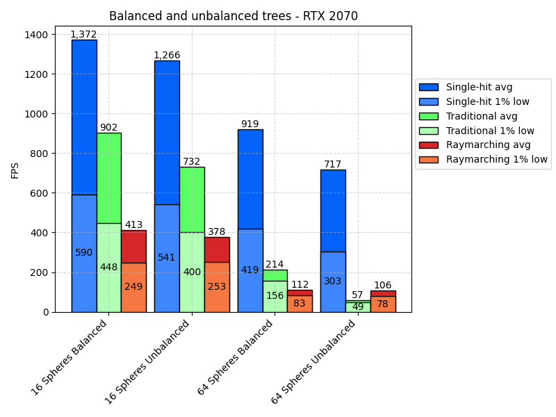
</p>

#### Scene density

In this test, **single-hit** was the clear winner—especially in **scenes with scattered primitives**. Thanks to its BVH acceleration structure, it can efficiently skip entire subtrees, significantly reducing computation time.

We also noticed that **cubes and cylinders** were more computationally expensive, with **cylinders being the most costly**. Interestingly, the **1% low FPS** remained similar across all primitive types.

Raymarching struggled in scenes with **clustered cubes** and a **high number of cylinders**, showing a major performance drop.

Traditional raycasting, on the other hand, was the **most stable** across all scene configurations. Its performance was barely affected by primitive types or spatial distribution.

###### Results for GTX 1050
<p align="center">
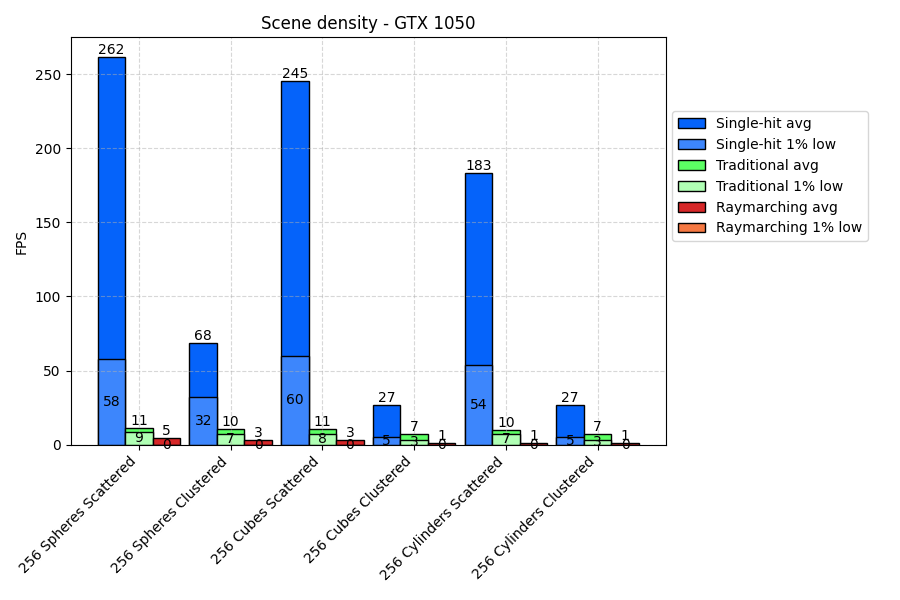
</p>
###### Results for GTX 1660
<p align="center">
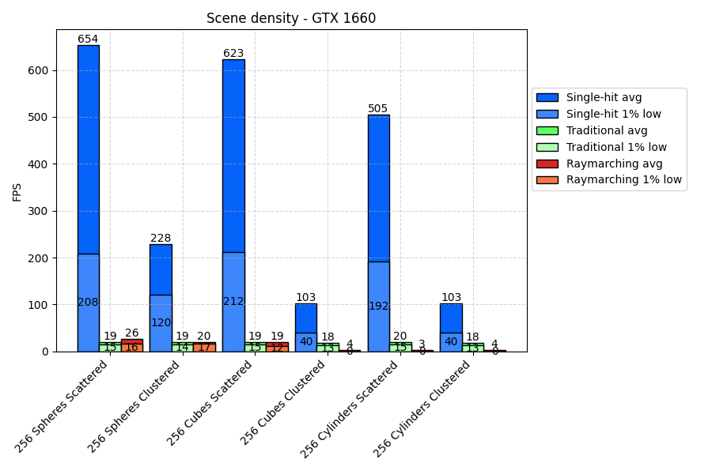
</p>
###### Results for RTX 2070
<p align="center">
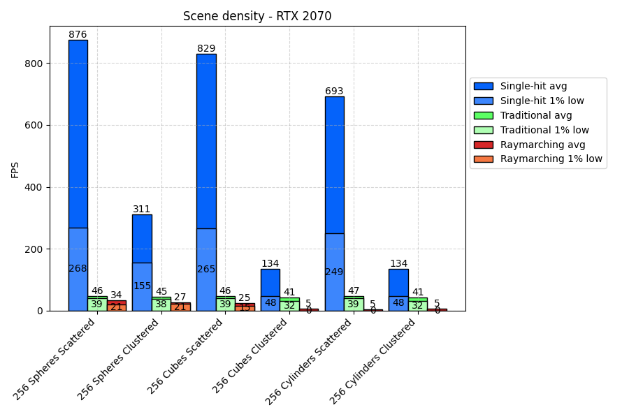
</p>

#### Binary operation test

In this test, the choice of **binary operation** (union, intersection, difference) had **minimal effect** on all three algorithms. It appears that **individual operations** don't drastically affect performance; rather, specific **combinations or structural patterns** within the CSG tree may be more important.

A small difference was observed in the **"only unions"** test, but this was caused by the camera flying **inside the tree**, which did not happen in the other two tests. This explains the **lower 1% low FPS** for single-hit in that particular case.

###### Results for GTX 1050
<p align="center">
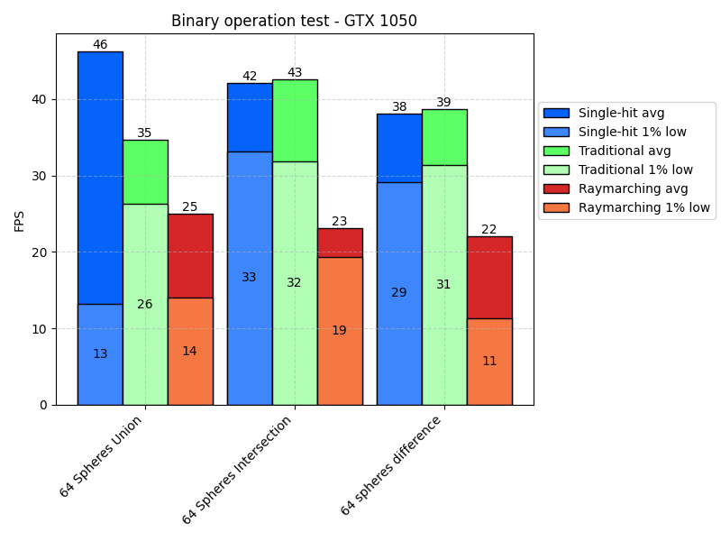
</p>
###### Results for GTX 1660
<p align="center">
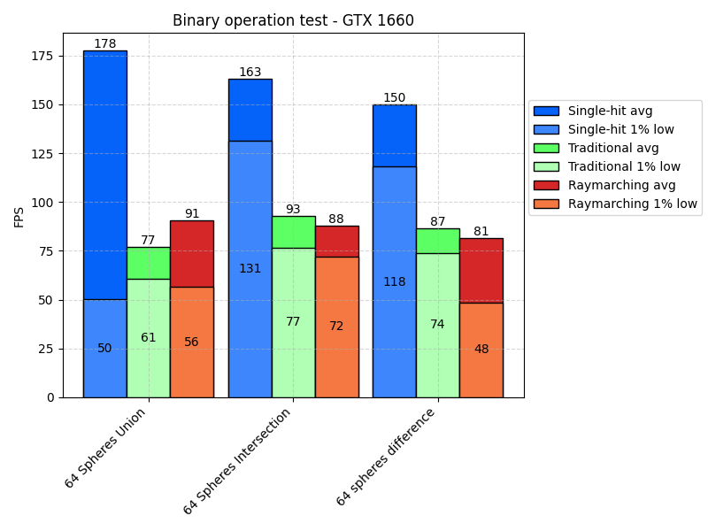
</p>
###### Results for RTX 2070
<p align="center">
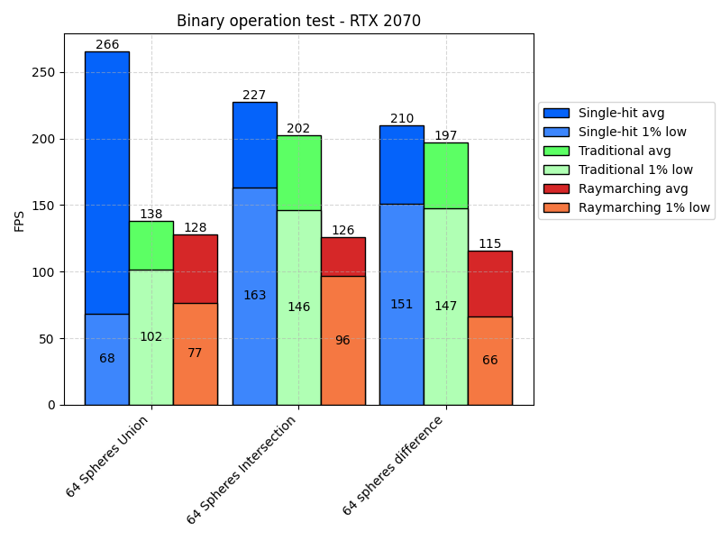
</p>

#### Unbalance side test

In this experiment, changing the direction in which the tree was unbalanced had **no significant impact** on performance across all algorithms. This may be due to the **small size of the trees** used in this test — or it might indicate that unbalance direction **simply doesn’t influence performance much**.

###### Results for GTX 1050
<p align="center">
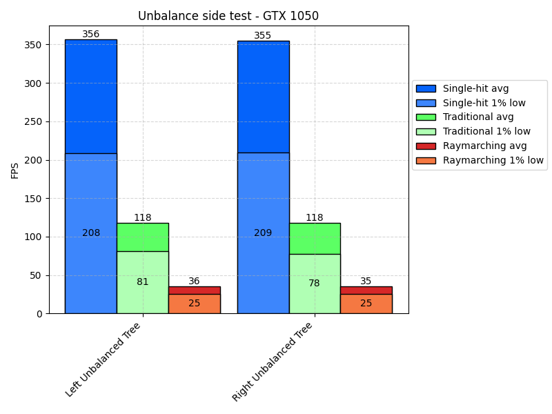
</p>
###### Results for GTX 1660
<p align="center">
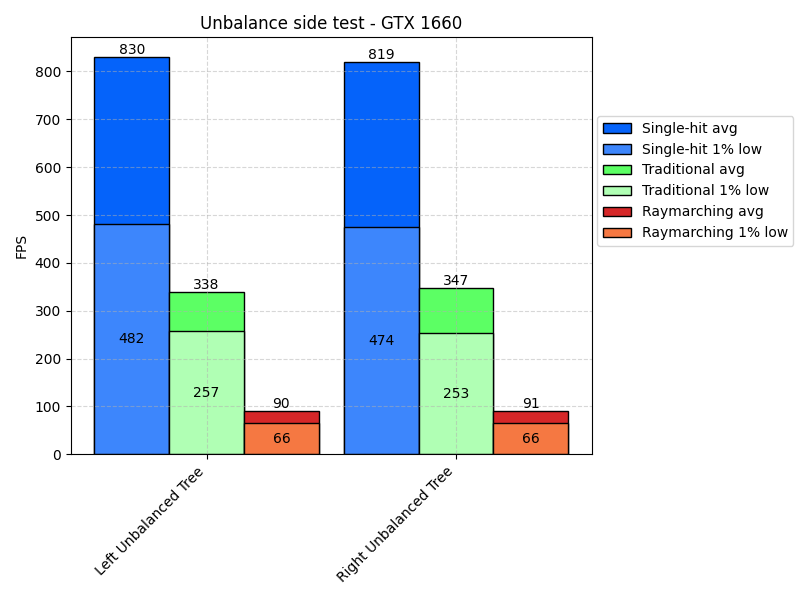
</p>
###### Results for RTX 2070
<p align="center">
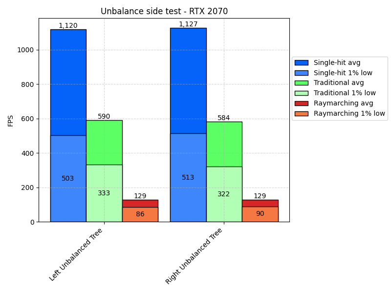
</p>

#### Usage test - cheese

This test featured a scene inspired by **Swiss cheese** — a cube with many spherical cutouts.

As expected, **single-hit** was the most performant. However, in the **512-cheese** variant, its advantage was **less clear**. Due to the scene’s structure, the algorithm was forced to **re-traverse subtrees multiple times**, which significantly reduced its benefit. In this case, **1% low FPS** dropped below that of the other algorithms.

###### Results for GTX 1050
<p align="center">
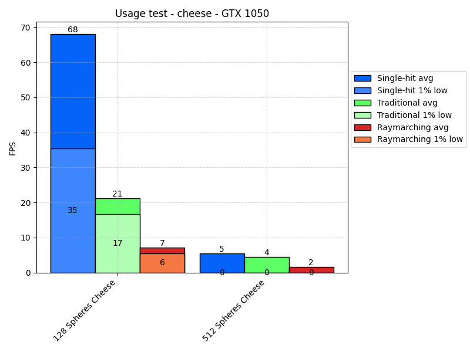
</p>
###### Results for GTX 1660
<p align="center">
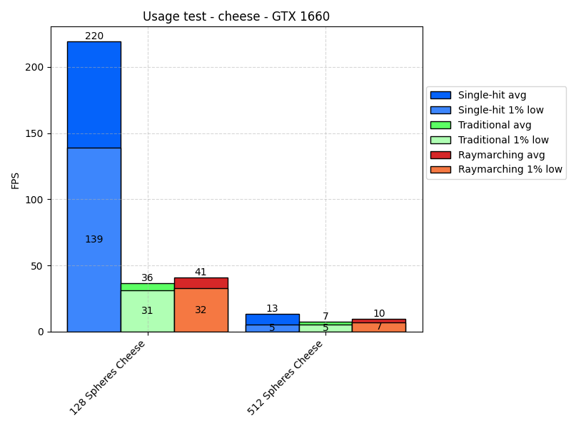
</p>
###### Results for RTX 2070
<p align="center">
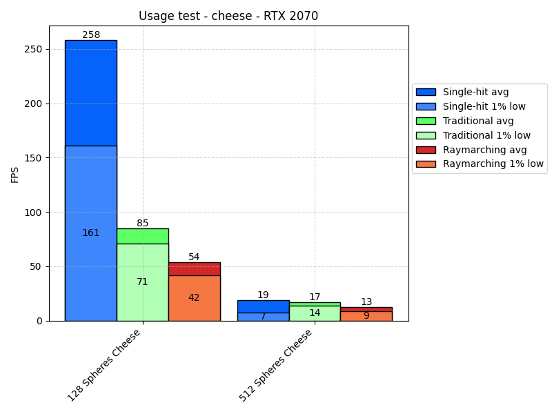
</p>

#### Usage test - labyrinth

Here, we compared two methods of modeling a maze in a 16×16 grid:

- One using only **unions of cubes** (to build the walls),
- The other using **difference operations** (cutting corridors from a solid cube).

The union-based approach had **many more primitives**, which negatively affected performance — especially on the **GTX 1050**, where fewer primitives led to much better results.

On the **GTX 1660**, performance of the **single-hit** algorithm became similar for both scenes, with a slight edge in 1% low FPS for the union-based version. Meanwhile, **traditional raycasting and raymarching** were still more efficient on the difference-based scene.

On the **RTX 2070**, single-hit made both approaches **nearly equal** in performance, although **raycasting** and **raymarching** still preferred the **smaller difference-based tree**.

###### Results for GTX 1050
<p align="center">
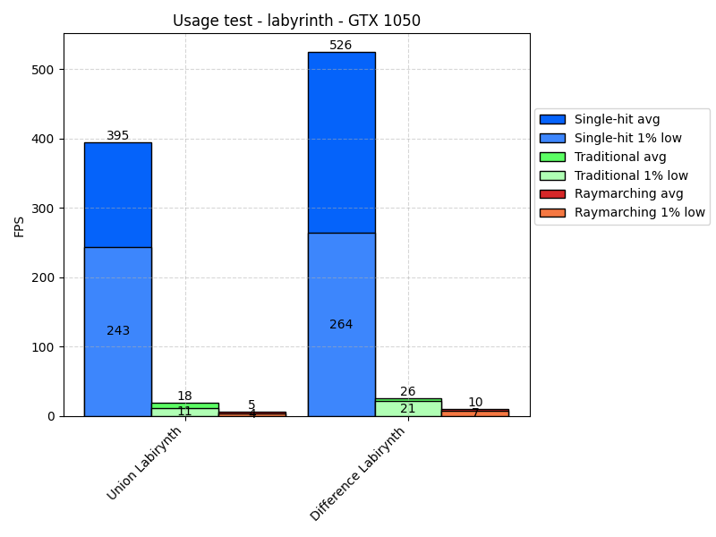
</p>
###### Results for GTX 1660
<p align="center">
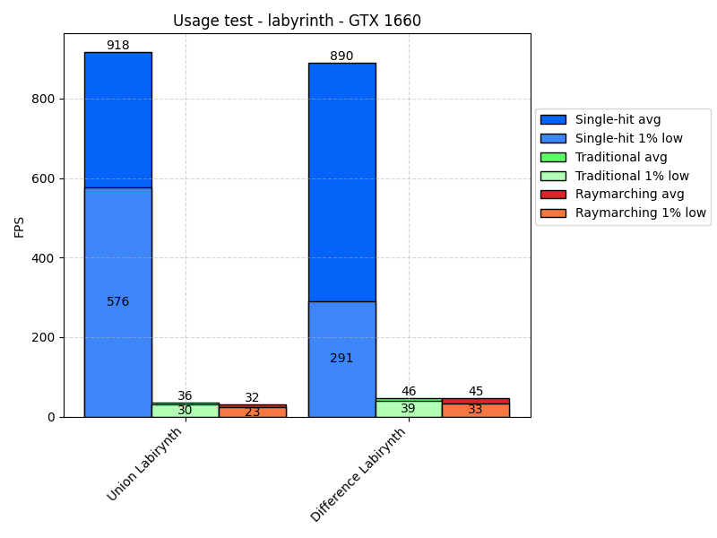
</p>
###### Results for RTX 2070
<p align="center">
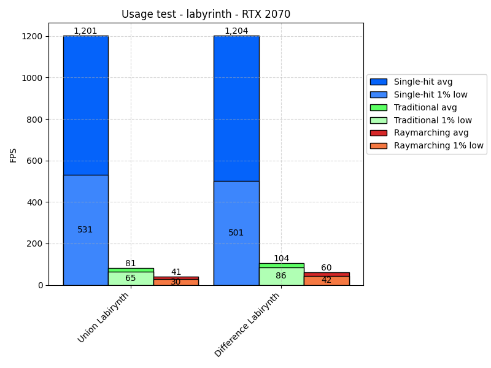
</p>
## Remarks

Overall, we observed that the **Single-hit** algorithm consistently outperformed the others across all tests. It also scaled very well with increased compute power. Our results show that it can easily handle trees with up to a thousand primitives, with strong potential to go even further depending on the tree structure and scene composition.

**Traditional raycasting** performed better than expected. Although it's heavily memory-bound, it showed good scaling with newer GPUs, often doubling its performance between generations. Unfortunately, it struggles significantly with unbalanced trees. This is an area worth investigating further, as there may be ways to optimize the algorithm to mitigate this issue. That said, traditional raycasting was the most stable in terms of frame rate consistency, as shown by its solid 1% low FPS.

**Raymarching**, while not as precise as raycasting and sometimes prone to minor visual artifacts, generally delivered performance close to that of traditional raycasting. Its flexibility — allowing for effects such as smoothing, deformation, infinite primitive repetition, and more — makes it a very appealing choice, especially in applications where visual appeal outweighs strict accuracy, such as video games.

## Future works

There is still a wide range of tests we could run, and potentially more performance metrics we could collect to better compare the algorithms and tree structures.

One promising direction would be to explore the optimal tree topologies for each algorithm — discovering which structures work best and developing transformations to convert arbitrary trees into these optimal forms.

Additionally, our current raymarcher lacks many of the features and optimizations it could support. Despite that, it still performed well. We would like to investigate raymarching further to give it a more balanced comparison and unlock its full potential.

## References
- **Andrew Kensler** - [Ray Tracing CSG Objects Using Single Hit Intersections](https://xrt.wdfiles.com/local--files/doc%3Acsg/CSG.pdf)
- **D.Y. Ulyanov**, **D.K. Bogolepov**, **V.E. Turlapov** - [Spatially Efficient Tree Layout for GPU Ray-tracing of Constructive Solid Geometry Scenes](https://ceur-ws.org/Vol-1576/090.pdf)
- **Inigo Quilez** - https://iquilezles.org/articles/ 
  A valuable resource with extensive articles and examples related to computer graphics, signed distance fields (SDFs), procedural rendering, and real-time shading.